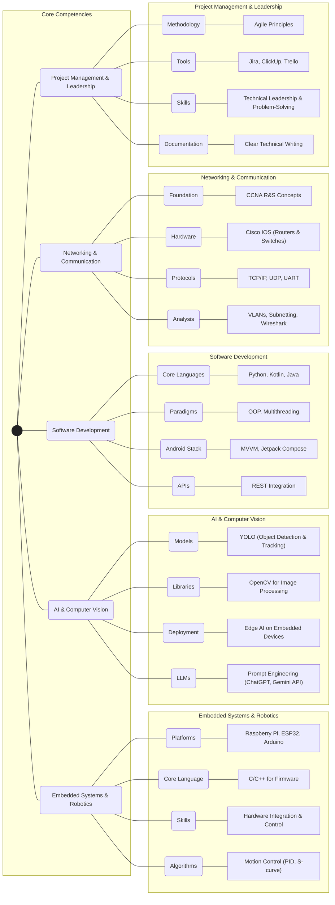

<!-- Header Image -->
<p align="center">
  
</p>

I'm a passionate engineer who loves building innovative tech solutions that merge hardware and software.

**Connect with me:**

[](https://www.linkedin.com/in/seif-elsayed)
[](mailto:your.email@example.com)
[](https://github.com/zSayf)

---

<details>
<summary><h3>Want to know more about me? Click here to expand!</h3></summary>
  
---
  
### ⚡ Tech Snapshot
This graph outlines my core technical competencies across key engineering domains.


  
---
  
### ✨ Featured Projects:
*   [**𝐒𝐡𝐢𝐞𝐥𝐝: 𝐀𝐧 𝐑𝐞𝐚𝐥-𝐭𝐢𝐦𝐞 𝐀𝐈-𝐏𝐨𝐰𝐞𝐫𝐞𝐝 𝐍𝐨𝐧-𝐋𝐞𝐭𝐡𝐚𝐥 𝐃𝐞𝐟𝐞𝐧𝐬𝐞 𝐒𝐲𝐬𝐭𝐞𝐦**](https://www.linkedin.com/posts/seif-elsayed_graduationproject-ai-robotics-activity-7351456699083276288-WJs5)
    *   🏆 **Awarded 2nd Place (#2)** nationwide among 582 projects in the Egyptian Universities & Institutes Competition.
    *   An integrated defense system using AI and embedded systems for non-lethal, real-time threat response. [See competition highlights](https://www.linkedin.com/posts/seif-elsayed_aeyaeraepaejabraepaedaefaeuaepaehaey-aelaeuaegaetaerabraelaetaeuaeyaer-activity-7364098800912625665-TX7R).

*   [**𝐒𝐡𝐚𝐫𝐤𝐁𝐚𝐢𝐭**](https://www.linkedin.com/posts/seif-elsayed_graduationproject-rov-activity-7352497326470365184-i7MA)
    *   A custom-built Remotely Operated Vehicle (ROV) designed for underwater exploration and data collection tasks.

*   [**𝐋𝐢𝐠𝐡𝐭𝐈𝐭𝐔𝐩**](https://www.linkedin.com/posts/seif-elsayed_two-is-not-enough-lets-drop-the-third-project-activity-7352547138003726336-dY0q)
    *   An IoT-based smart lighting system featuring customizable animations and remote control capabilities via a mobile app.

---
  
### 📊 My GitHub Activity:
<p align="center">
  
  
</p>

</details>

---

<!-- Snake animation -->
<p align="center">
  
</p>
```
