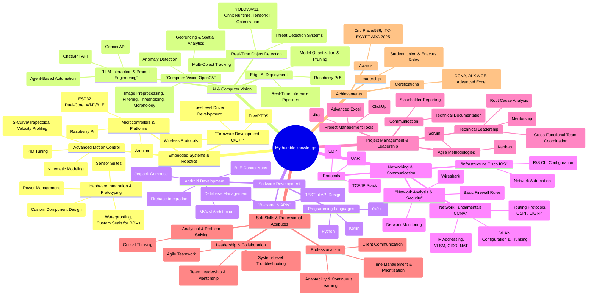

<!-- Header Image -->

  

Passionate Electronics & Communications Engineer specializing in building award-winning, intelligent systems that bridge the gap between hardware and software.

<!-- Centered and professional LinkedIn Badge -->

  <strong>Let's Connect:</strong>  
  

---

<h3>Technical Deep Dive & GitHub Stats</h3>

  
---
  
### ⚡ Tech Snapshot
This mindmap provides a detailed overview of my technical skills.

  
---
  
### ✨ Featured Projects

*   <a href="https://www.linkedin.com/posts/seif-elsayed_graduationproject-ai-robotics-activity-7351456699083276288-WJs5" target="_blank">**𝐒𝐡𝐢𝐞𝐥𝐝: 𝐀𝐧 𝐑𝐞𝐚𝐥-𝐭𝐢𝐦𝐞 𝐀𝐈-𝐏𝐨𝐰𝐞𝐫𝐞𝐝 𝐍𝐨𝐧-𝐋𝐞𝐭𝐡𝐚𝐥 𝐃𝐞𝐟𝐞𝐧𝐬𝐞 𝐒𝐲𝐬𝐭𝐞𝐦**</a>
    *   🏆 **Awarded 2nd Place (#2)** nationwide among 582 projects in the Egyptian Universities & Institutes Competition ([ITC EGYPT ADC 2025](https://www.facebook.com/itc2025adc)).
    *   **Tech Stack:** `Python`, `YOLOv8`, `OpenCV`, `Raspberry Pi 5`, `ESP32`, `C++`, `Kotlin (Android)`.
    *   An integrated defense system using AI... <a href="https://www.linkedin.com/posts/seif-elsayed_aeyaeraepaejabraepaedaefaeuaepaehaey-aelaeuaegaetaerabraelaetaeuaeyaer-activity-7364089800912625665-TX7R" target="_blank">See competition highlights</a>.

*   <a href="https://www.linkedin.com/posts/seif-elsayed_graduationproject-rov-activity-7352497326470365184-i7MA" target="_blank">**𝐒𝐡𝐚𝐫𝐤𝐁𝐚𝐢𝐭**</a>
    *   A custom-built Remotely Operated Vehicle (ROV) designed for underwater exploration and data collection tasks.

*   <a href="https://www.linkedin.com/posts/seif-elsayed_two-is-not-enough-lets-drop-the-third-project-activity-7352547138003726336-dY0q" target="_blank">**𝐋𝐢𝐠𝐡𝐭𝐈𝐭𝐔𝐩**</a>
    *   An IoT-based smart lighting system featuring customizable animations and remote control capabilities via a mobile app.

---
  
### 📊 My GitHub Activity:

  

---

<!-- Snake animation with a cool title -->

  <h4>My GitHub Activity Snake 🐍</h4>
  

