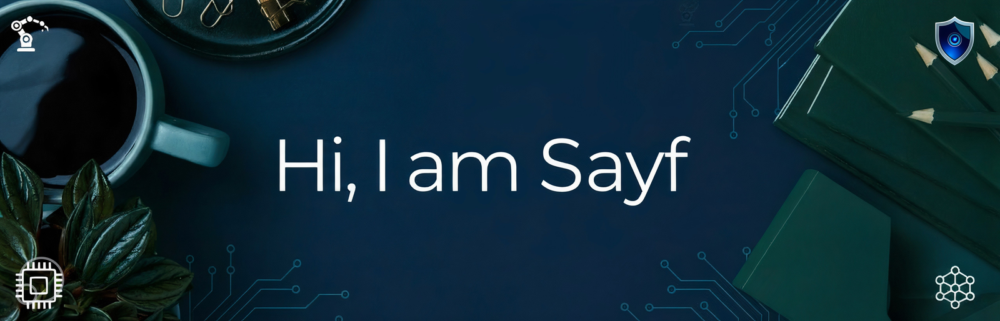
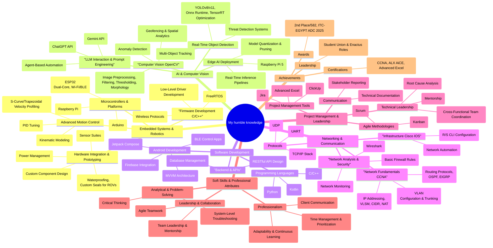

<!-- Header Image -->

  

Passionate Electronics & Communications Engineer specializing in building award-winning, intelligent systems that bridge the gap between hardware and software.

<!-- Centered and professional LinkedIn Badge -->

  <strong>Let's Connect:</strong>  
  

---

### 🛠️ Tech Stack

  
  
  
  
  
  
  
  
  
  
  
  
  

### ✨ Featured Projects

*   <a href="https://www.linkedin.com/posts/seif-elsayed_graduationproject-ai-robotics-activity-7351456699083276288-WJs5" target="_blank">**𝐒𝐡𝐢𝐞𝐥𝐝: 𝐀𝐧 𝐑𝐞𝐚𝐥-𝐭𝐢𝐦𝐞 𝐀𝐈-𝐏𝐨𝐰𝐞𝐫𝐞𝐝 𝐍𝐨𝐧-𝐋𝐞𝐭𝐡𝐚𝐥 𝐃𝐞𝐟𝐞𝐧𝐬𝐞 𝐒𝐲𝐬𝐭𝐞𝐦**</a>
    *   🏆 **Awarded 2nd Place (#2)** nationwide among 582 projects in the Egyptian Universities & Institutes Competition ([ITC EGYPT ADC 2025](https://www.facebook.com/itc2025adc)).
    *   **Tech Stack:** `Python`, `YOLOv8`, `OpenCV`, `Raspberry Pi 5`, `ESP32`, `C++`, `Kotlin (Android)`.
    *   An integrated defense system using AI... <a href="https://www.linkedin.com/posts/seif-elsayed_aeyaeraepaejabraepaedaefaeuaepaehaey-aelaeuaegaetaerabraelaetaeuaeyaer-activity-7364089800912625665-TX7R" target="_blank">See competition highlights</a>.

*   <a href="https://www.linkedin.com/posts/seif-elsayed_graduationproject-rov-activity-7352497326470365184-i7MA" target="_blank">**𝐒𝐡𝐚𝐫𝐤𝐁𝐚𝐢𝐭**</a>
    *   A custom-built Remotely Operated Vehicle (ROV) designed for underwater exploration and data collection tasks.

*   <a href="https://www.linkedin.com/posts/seif-elsayed_two-is-not-enough-lets-drop-the-third-project-activity-7352547138003726336-dY0q" target="_blank">**𝐋𝐢𝐠𝐡𝐭𝐈𝐭𝐔𝐩**</a>
    *   An IoT-based smart lighting system featuring customizable animations and remote control capabilities via a mobile app.

---

<h3>🧠 Technical Deep Dive (full skills mindmap)</h3>

  
---
  
### ⚡ Tech Snapshot
This mindmap provides a detailed overview of my technical skills.

```mermaid
mindmap
  root((My humble knowledge))
    Embedded Systems & Robotics
      Microcontrollers & Platforms
        - (Raspberry Pi)
        - (ESP32 
        Dual-Core, Wi-Fi/BLE)
        - (Arduino)
      Hardware Integration & Prototyping
        - (Sensor Suites)
        - (Power Management)
        - (Waterproofing, 
        Custom Seals for ROVs)
        - (Custom Component Design)
      "Firmware Development C/C++"
        - (FreeRTOS)
        - (Wireless Protocols)
        - (Low-Level Driver Development)
      Advanced Motion Control
        - (PID Tuning)
        - (S-Curve/Trapezoidal Velocity Profiling)
        - (Kinematic Modeling)
    AI & Computer Vision
      Real-Time Object Detection
        - (YOLOv8/v11, 
        Onnx Runtime, TensorRT Optimization)
        - (Multi-Object Tracking)
        - (Threat Detection Systems)
      "Computer Vision OpenCV"
        - (Image Preprocessing, 
        Filtering, Thresholding, Morphology)
        - (Geofencing & Spatial Analytics)
        - (Anomaly Detection)
      Edge AI Deployment
        - (Raspberry Pi 5)
        - (Model Quantization & Pruning)
        - (Real-Time Inference Pipelines)
      "LLM Interaction & Prompt Engineering"
        - (ChatGPT API) 
        - (Gemini API)
        - (Agent-Based Automation)
    Software Development
      Programming Languages
        - (Python)
        - ("C/C++")
        - (Kotlin)
      Android Development
        - (Jetpack Compose)
        - (MVVM Architecture)
        - (BLE Control Apps)
        - (Firebase Integration)
      "Backend & APIs"
        - (RESTful API Design)
        - (Database Management)
    Networking & Communication
      "Network Fundamentals CCNA"
        - (Routing Protocols, 
        OSPF, EIGRP)
        - (IP Addressing, 
        VLSM, CIDR, NAT)
        - (VLAN 
        Configuration & Trunking)
      "Infrastructure Cisco IOS"
        - (R/S CLI Configuration)
        - (Network Automation)
      Protocols
        - (TCP/IP Stack)
        - (UDP)
        - (UART)
      "Network Analysis & Security"
        - (Wireshark)
        - (Network Monitoring)
        - (Basic Firewall Rules)
    Project Management & Leadership
      Agile Methodologies
        - (Scrum)
        - (Kanban)
      Project Management Tools
        - (Jira)
        - (ClickUp)
        - (Advanced Excel)
      Technical Leadership
        - (Cross-Functional Team Coordination)
        - (Root Cause Analysis)
        - (Mentorship)
      Communication
        - (Technical Documentation)
        - (Stakeholder Reporting)
    Soft Skills & Professional Attributes
      Leadership & Collaboration
        - (Team Leadership & Mentorship)
        - (Agile Teamwork)
      Analytical & Problem-Solving
        - (Critical Thinking)
        - (System-Level Troubleshooting)
      Professionalism
        - (Client Communication)
        - (Time Management & Prioritization)
        - (Adaptability & Continuous Learning)
    Achievements
      Awards
        - (2nd Place/582, ITC-EGYPT ADC 2025)
      Certifications
        - (CCNA, ALX AiCE, Advanced Excel)
      Leadership
        - (Student Union & Enactus Roles)

```
  

---

### 📊 GitHub Stats

  <picture>
    <source media="(prefers-color-scheme: dark)" srcset="https://github-readme-stats.vercel.app/api?username=zSayf&show_icons=true&hide_border=true&theme=github_dark">
    
  </picture>
  <picture>
    <source media="(prefers-color-scheme: dark)" srcset="https://github-readme-stats.vercel.app/api/top-langs/?username=zSayf&layout=compact&hide_border=true&theme=github_dark">
    
  </picture>

---

<!-- Snake animation with a cool title -->

  <h4>My GitHub Activity Snake 🐍</h4>
  <picture>
    <source media="(prefers-color-scheme: dark)" srcset="https://raw.githubusercontent.com/zSayf/zSayf/main/dist/github-contribution-grid-snake-dark.svg">
    
  </picture>

